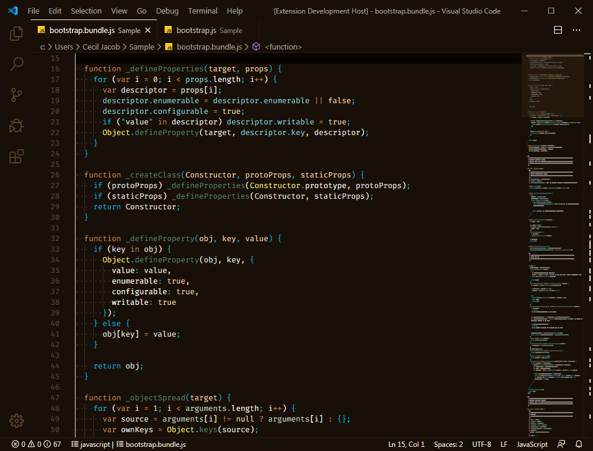

# Overcast Theme

This is a Visual Studio Code theme with subtle syntax colors on a dark background.
  

## Theme Screenshot

### Dark Blue Theme

  

### Dark Brown Theme

  

## Installation

Open the __Extensions__ sidebar panel from within the Visual Studio Code editor window. 
Menu Path : `View > Extensions`

Search for the theme in the extension marketplace search and then click the __Install__ button. 
Search Term : `overcast-code-theme`

Enable the installed theme from the Color Theme drop down list. 
Menu Path : `Code / File > Preferences > Color Theme > Overcast`
  

## License

This work is licensed under the __Creative Commons Attribution 4.0 International License__ terms. 
[Creative Commons Attribution 4.0 International License](https://creativecommons.org/licenses/by/4.0/legalcode)
  

## Feedback

Please report issues related to this theme on the repository page. 
[GitHub Repository](https://github.com/ceciljacob/overcast-code-theme/issues)
  

Copyright &copy; [Cecil Jacob](https://www.ceciljacob.com) &amp; [BEAIM Technology](https://www.beaim.com)
 
